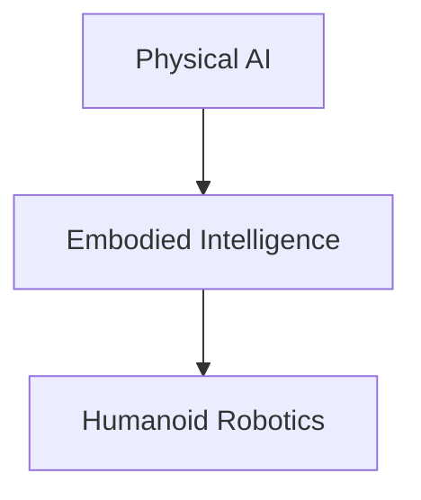

# Quickstart Guide: Physical AI & Humanoid Robotics Textbook

## Getting Started

This guide will help you set up, run, and contribute to the Physical AI & Humanoid Robotics textbook project.

## Prerequisites

- Node.js (version 18 or higher)
- npm or yarn package manager
- Git
- Basic knowledge of Markdown and MDX

## Setup Instructions

1. **Clone the repository**:
   ```bash
   git clone <your-repo-url>
   cd physical-ai-and-humanoid-robotics-textbook
   cd frontend
   ```

2. **Install dependencies**:
   ```bash
   npm install
   ```

3. **Set up environment variables** (for RAG chatbot):
   Create a `.env` file in the frontend directory with your Gemini API key:
   ```
   GEMINI_API_KEY=your_api_key_here
   ```

4. **Run the development server**:
   ```bash
   npm run start
   ```
   The textbook will be available at `http://localhost:3000`

## Project Structure

- `docs/` - All textbook content (7 chapters + bonus pages)
- `src/` - Custom components, theme overrides, and styling
- `static/` - Images and static assets
- `i18n/` - Translation files for English and Urdu
- `docusaurus.config.ts` - Main configuration for the site
- `sidebars.ts` - Navigation structure

## Creating Content

### Adding a New Chapter

1. Create a new directory in `docs/` with a descriptive name
2. Add an `index.md` file with the chapter content in MDX format
3. Include the required elements at the end of each chapter:
   - Learning Outcomes
   - Hands-on Lab Exercise (with ROS 2 Python code)
   - Interactive Quiz
   - Further Reading section
   - 2-3 visual elements (screenshots, diagrams, Mermaid charts)

### Using Visual Elements

Add diagrams using Mermaid syntax:
```

```

### Adding Code Examples

Include ROS 2 Python code with proper syntax highlighting:
```
```python
import rclpy
from rclpy.node import Node

class MinimalPublisher(Node):
    def __init__(self):
        super().__init__('minimal_publisher')
        self.publisher_ = self.create_publisher(String, 'topic', 10)
        timer_period = 0.5  # seconds
        self.timer = self.create_timer(timer_period, self.timer_callback)
        self.i = 0

    def timer_callback(self):
        msg = String()
        msg.data = 'Hello World: %d' % self.i
        self.publisher_.publish(msg)
        self.i += 1
```
```

## Custom Components

### Quiz Component

Use the quiz component at the end of each chapter:
```
<QuizComponent chapterId="introduction-physical-ai" />
```

### Summary Component

Use the summary component after the quiz:
```
<SummaryComponent chapterId="introduction-physical-ai" />
```

## Internationalization (i18n)

The textbook supports both English and Urdu. To add translations:

1. Add content to the appropriate files in `i18n/en/` for English
2. Add corresponding content to `i18n/ur/` for Urdu
3. Update the translation files when adding new UI elements

## Custom Styling

### Color Scheme

The theme uses a custom dark purple color scheme:
- Primary: #6B46C1
- Dark: #553C9A
- Accents: #E9D8FD

To modify colors, update the CSS variables in `src/css/colors.css`.

## Building for Production

To build the textbook for deployment:

```bash
npm run build
```

The static files will be created in the `build/` directory.

## Deployment

The project is configured for GitHub Pages deployment using GitHub Actions. When you push to the main branch, the workflow in `.github/workflows/deploy.yml` will automatically build and deploy the site.

## Contributing

1. Create a feature branch: `git checkout -b feature-name`
2. Make your changes following the project's style and conventions
3. Test your changes locally
4. Commit your changes with a descriptive message
5. Push to your fork and submit a pull request

## Troubleshooting

- If images don't load, ensure they are placed in the `static/img/` directory
- If the build fails, check that all MDX files have proper syntax
- If the RAG chatbot doesn't work, verify that the GEMINI_API_KEY is correctly set
- For translation issues, ensure both English and Urdu files are properly updated

## Next Steps

1. Explore the existing chapters in `docs/` to understand the content structure
2. Review the custom components in `src/components/` to understand available features
3. Check the configuration in `docusaurus.config.ts` to understand site settings
4. Look at the sidebar configuration in `sidebars.ts` to understand the navigation